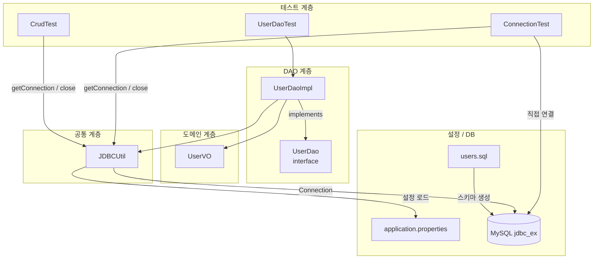
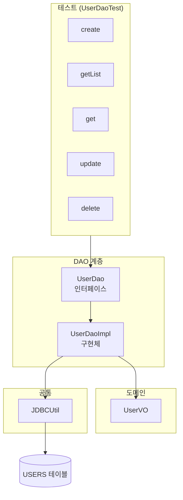
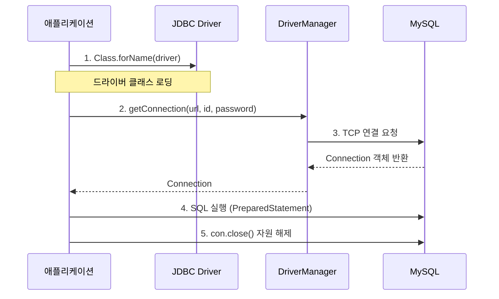
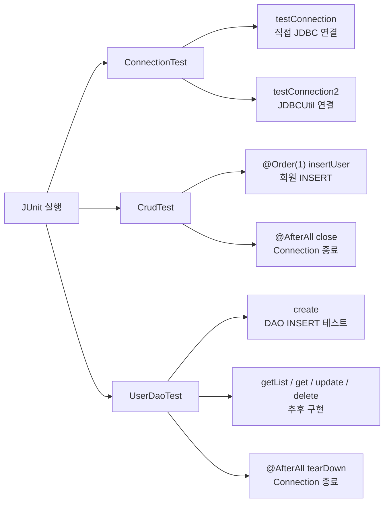
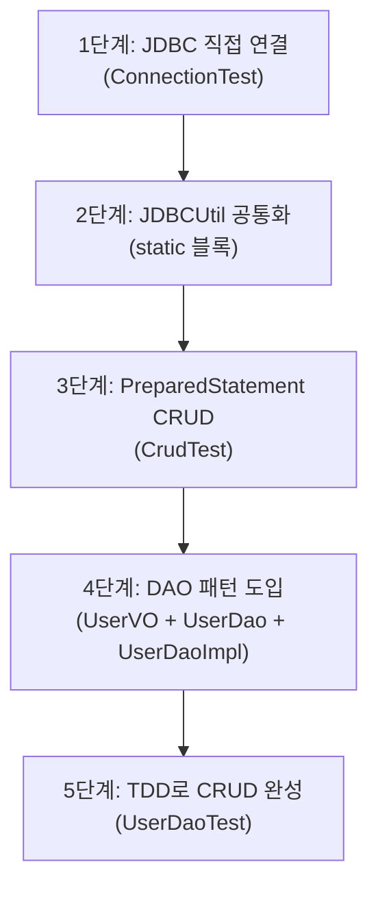

# JDBC Ex

Java JDBC 연습 프로젝트입니다. MySQL 데이터베이스에 연결하고, `PreparedStatement`를 사용해 CRUD 작업을 수행합니다.  
초기에는 JDBC를 직접 사용하고, 이후 **DAO(Data Access Object) 패턴**으로 DB 접근 로직을 분리합니다. JUnit 5로 단계별 테스트를 진행합니다.

---

## 프로젝트 구조



---

## 계층 구조 (DAO 패턴)



---

## JDBC 연결 흐름

JDBC는 DB와 통신하기 위해 **4단계**를 거칩니다.



---

## 파일 구성

| 경로 | 역할 | 설명 |
|------|------|------|
| `src/main/java/org/scoula/jdbc_ex/common/JDBCUtil.java` | DB 연결 유틸 | static 블록으로 드라이버 로딩 및 Connection 생성 |
| `src/main/java/org/scoula/jdbc_ex/domain/UserVO.java` | 도메인 객체 | `users` 테이블과 매핑되는 Value Object |
| `src/main/java/org/scoula/jdbc_ex/dao/UserDao.java` | DAO 인터페이스 | CRUD 기능을 추상 메서드로 정의 |
| `src/main/java/org/scoula/jdbc_ex/dao/UserDaoImpl.java` | DAO 구현체 | JDBC + PreparedStatement로 CRUD 구현 |
| `src/main/resources/application.properties` | DB 설정 | 드라이버, URL, 계정 정보 |
| `src/test/java/org/scoula/jdbc_ex/ConnectionTest.java` | 연결 테스트 | JDBC 직접 연결 / JDBCUtil 연결 검증 |
| `src/test/java/org/scoula/jdbc_ex/CrudTest.java` | CRUD 테스트 | INSERT 등 SQL 직접 실행 테스트 |
| `src/test/java/org/scoula/jdbc_ex/dao/UserDaoTest.java` | DAO 테스트 | UserDaoImpl CRUD 단위 테스트 |
| `users.sql` | DB 초기화 | DB·테이블 생성 및 샘플 데이터 |
| `build.gradle` | 빌드 설정 | MySQL Connector, Lombok, JUnit 5 의존성 |

---

## 클래스 / 메서드 정리

### UserVO (도메인)

| 필드 | 타입 | 설명 |
|------|------|------|
| `id` | `String` | 사용자 아이디 |
| `password` | `String` | 비밀번호 |
| `name` | `String` | 이름 |
| `role` | `String` | 권한 (`USER`, `ADMIN`) |

> Lombok `@Data`, `@NoArgsConstructor`, `@AllArgsConstructor` 적용

### UserDao (인터페이스)

| 메서드 | 반환 타입 | 설명 |
|--------|-----------|------|
| `create(UserVO user)` | `int` | 회원 등록 (INSERT) |
| `getList()` | `List<UserVO>` | 회원 목록 조회 (SELECT) |
| `get(String id)` | `Optional<UserVO>` | 회원 단건 조회 (SELECT) |
| `update(UserVO user)` | `int` | 회원 수정 (UPDATE) |
| `delete(String id)` | `int` | 회원 삭제 (DELETE) |

### UserDaoImpl (구현체)

| SQL 상수 | SQL |
|----------|-----|
| `USER_LIST` | `SELECT * FROM users` |
| `USER_GET` | `SELECT * FROM users WHERE id = ?` |
| `USER_INSERT` | `INSERT INTO users VALUES(?, ?, ?, ?)` |
| `USER_UPDATE` | `UPDATE users SET name = ?, role = ? WHERE id = ?` |
| `USER_DELETE` | `DELETE FROM users WHERE id = ?` |

| 메서드 | 구현 상태 | 설명 |
|--------|-----------|------|
| `create()` | ✅ 완료 | try-with-resources로 INSERT 실행 |
| `getList()` | 🔲 미구현 | `List.of()` 반환 |
| `get()` | 🔲 미구현 | `Optional.empty()` 반환 |
| `update()` | 🔲 미구현 | `0` 반환 |
| `delete()` | 🔲 미구현 | `0` 반환 |

### JDBCUtil

| 메서드 | 반환 타입 | 설명 |
|--------|-----------|------|
| `getConnection()` | `Connection` | static 블록에서 생성된 Connection 반환 |
| `close()` | `void` | Connection 종료 후 `null` 처리 |

### ConnectionTest

| 메서드 | 테스트 내용 |
|--------|-------------|
| `testConnection()` | `Class.forName` + `DriverManager`로 직접 DB 연결 |
| `testConnection2()` | `JDBCUtil`을 통한 DB 연결 및 종료 |

### CrudTest

| 메서드 | `@Order` | 테스트 내용 |
|--------|----------|-------------|
| `insertUser()` | 1 | `users` 테이블에 회원 INSERT |
| `close()` | `@AfterAll` | 모든 테스트 후 Connection 종료 |

### UserDaoTest

| 메서드 | 테스트 내용 | 구현 상태 |
|--------|-------------|-----------|
| `create()` | `UserDaoImpl.create()` — 회원 등록 | ✅ 완료 |
| `getList()` | 회원 목록 조회 | 🔲 미구현 |
| `get()` | 회원 단건 조회 | 🔲 미구현 |
| `update()` | 회원 수정 | 🔲 미구현 |
| `delete()` | 회원 삭제 | 🔲 미구현 |
| `tearDown()` | `@AfterAll` — Connection 종료 | ✅ 완료 |

---

## DB 스키마

### USERS 테이블

| 컬럼 | 타입 | 제약 | 설명 |
|------|------|------|------|
| `ID` | `VARCHAR(12)` | PK, NOT NULL | 사용자 아이디 |
| `PASSWORD` | `VARCHAR(12)` | NOT NULL | 비밀번호 |
| `NAME` | `VARCHAR(30)` | NOT NULL | 이름 |
| `ROLE` | `VARCHAR(6)` | NOT NULL | 권한 (`USER`, `ADMIN`) |

---

## 사전 준비

### 1. MySQL 데이터베이스 생성

`users.sql`을 실행하여 DB, 사용자, 테이블을 생성합니다.

```sql
CREATE DATABASE jdbc_ex;

CREATE USER 'scoula'@'%' IDENTIFIED BY '1234';
GRANT ALL PRIVILEGES ON jdbc_ex.* TO 'scoula'@'%';
FLUSH PRIVILEGES;

USE jdbc_ex;

CREATE TABLE USERS (
    ID       VARCHAR(12) NOT NULL PRIMARY KEY,
    PASSWORD VARCHAR(12) NOT NULL,
    NAME     VARCHAR(30) NOT NULL,
    ROLE     VARCHAR(6)  NOT NULL
);
```

### 2. application.properties 설정

```properties
driver=com.mysql.cj.jdbc.Driver
url=jdbc:mysql://127.0.0.1:3306/jdbc_ex
id=scoula
password=1234
```

---

## 핵심 코드 설명

### 1. JDBC 직접 연결 (ConnectionTest)

드라이버 로딩 → Connection 획득 → 사용 후 종료 순서로 동작합니다.

```java
// 1단계: JDBC 드라이버 로딩
Class.forName("com.mysql.cj.jdbc.Driver");

// 2단계: DB 연결 (url, id, password)
String url = "jdbc:mysql://127.0.0.1:3306/jdbc_ex";
Connection con = DriverManager.getConnection(url, "scoula", "1234");

// 3단계: 자원 해제
con.close();
```

### 2. JDBCUtil — 연결 공통화

CRUD 작업마다 1~2단계(드라이버 로딩, 연결)를 반복하지 않도록 static 블록에서 한 번만 초기화합니다.

```java
static {
    Properties properties = new Properties();
    properties.load(JDBCUtil.class.getResourceAsStream("/application.properties"));

    String driver   = properties.getProperty("driver");
    String url      = properties.getProperty("url");
    String id       = properties.getProperty("id");
    String password = properties.getProperty("password");

    Class.forName(driver);
    con = DriverManager.getConnection(url, id, password);
}

public static Connection getConnection() {
    return con;
}
```

> **static 블록이란?**  
> 객체 생성(`new`) 없이 클래스 로딩 시점에 자동 실행되는 초기화 블록입니다.  
> `static` 필드(`con`)는 생성자로 초기화할 수 없으므로 static 블록을 사용합니다.

### 3. INSERT — PreparedStatement (CrudTest)

`?` 플레이스홀더로 SQL Injection을 방지하고, 값을 순서대로 바인딩합니다.

```java
String sql = "INSERT INTO users(id, password, name, role) VALUES(?, ?, ?, ?)";
PreparedStatement pstmt = con.prepareStatement(sql);

pstmt.setString(1, "winner2");  // id
pstmt.setString(2, "1234");     // password
pstmt.setString(3, "win");      // name
pstmt.setString(4, "admin");    // role

int row = pstmt.executeUpdate(); // 영향받은 행 수 반환
pstmt.close();
```

### 4. UserVO — 도메인 객체 (UserVO)

DB 테이블의 한 행(row)을 Java 객체로 표현합니다. Lombok으로 getter/setter/생성자를 자동 생성합니다.

```java
@Data
@NoArgsConstructor
@AllArgsConstructor
public class UserVO {
    private String id;
    private String password;
    private String name;
    private String role;
}
```

### 5. UserDao — 인터페이스 (UserDao)

구현 클래스가 반드시 제공해야 할 CRUD 기능을 추상 메서드로 정의합니다.

```java
public interface UserDao {
    int create(UserVO user) throws SQLException;
    List<UserVO> getList() throws SQLException;
    Optional<UserVO> get(String id) throws SQLException;
    int update(UserVO user) throws SQLException;
    int delete(String id) throws SQLException;
}
```

### 6. UserDaoImpl — DAO 구현 (UserDaoImpl)

인터페이스를 구현하고, SQL을 클래스 내부 상수로 관리합니다.  
`try-with-resources`로 `PreparedStatement`를 자동 close합니다.

```java
public class UserDaoImpl implements UserDao {
    Connection conn = JDBCUtil.getConnection();

    private String USER_INSERT = "insert into users values(?, ?, ?, ?)";

    @Override
    public int create(UserVO user) throws SQLException {
        try (PreparedStatement stmt = conn.prepareStatement(USER_INSERT)) {
            stmt.setString(1, user.getId());
            stmt.setString(2, user.getPassword());
            stmt.setString(3, user.getName());
            stmt.setString(4, user.getRole());
            return stmt.executeUpdate();
        }
    }
}
```

### 7. UserDaoTest — TDD 방식 테스트

테스트를 먼저 작성하고, DAO 구현체를 단계적으로 완성합니다.

```java
@TestMethodOrder(MethodOrderer.OrderAnnotation.class)
class UserDaoTest {
    UserDao dao = new UserDaoImpl();

    @AfterAll
    static void tearDown() {
        JDBCUtil.close();
    }

    @Test
    void create() throws SQLException {
        UserVO user = new UserVO("app", "1234", "app", "admin");
        int count = dao.create(user);
        Assertions.assertEquals(1, count);
    }
}
```

---

## 테스트 실행 흐름



### 테스트 실행 명령

```bash
# Windows
gradlew.bat test

# macOS / Linux
./gradlew test
```

특정 테스트만 실행:

```bash
gradlew.bat test --tests "org.scoula.jdbc_ex.ConnectionTest"
gradlew.bat test --tests "org.scoula.jdbc_ex.CrudTest"
gradlew.bat test --tests "org.scoula.jdbc_ex.dao.UserDaoTest"
```

---

## 의존성

| 라이브러리 | 버전 | 용도 |
|------------|------|------|
| `mysql-connector-j` | 8.3.0 | MySQL JDBC 드라이버 |
| `lombok` | 1.18.30 | 보일러플레이트 코드 제거 |
| `junit-jupiter` | 5.10.0 | 단위 테스트 |

---

## JDBC 단계 요약

| 단계 | 작업 | 사용 클래스 / 메서드 |
|------|------|----------------------|
| 1 | 드라이버 로딩 | `Class.forName(driver)` |
| 2 | DB 연결 | `DriverManager.getConnection(url, id, pw)` |
| 3 | SQL 실행 | `Connection.prepareStatement(sql)` |
| 4 | 자원 해제 | `Connection.close()`, `PreparedStatement.close()` |

---

## 학습 진행 순서



<hr>


<br>
<hr>
<br>


<hr>
<br>
- 인터페이스/클래스 <br>


