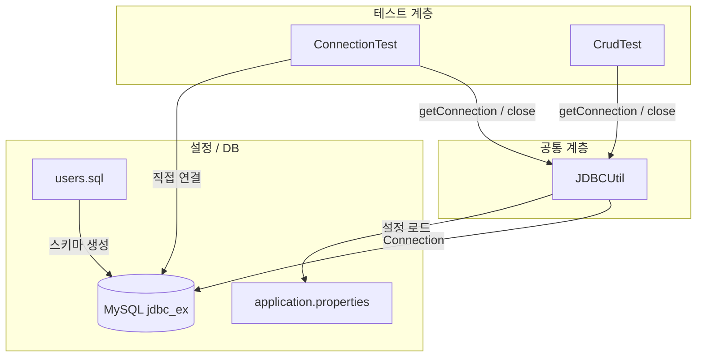
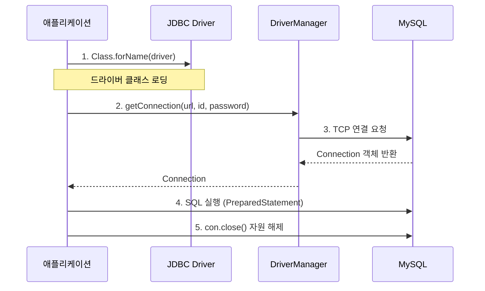
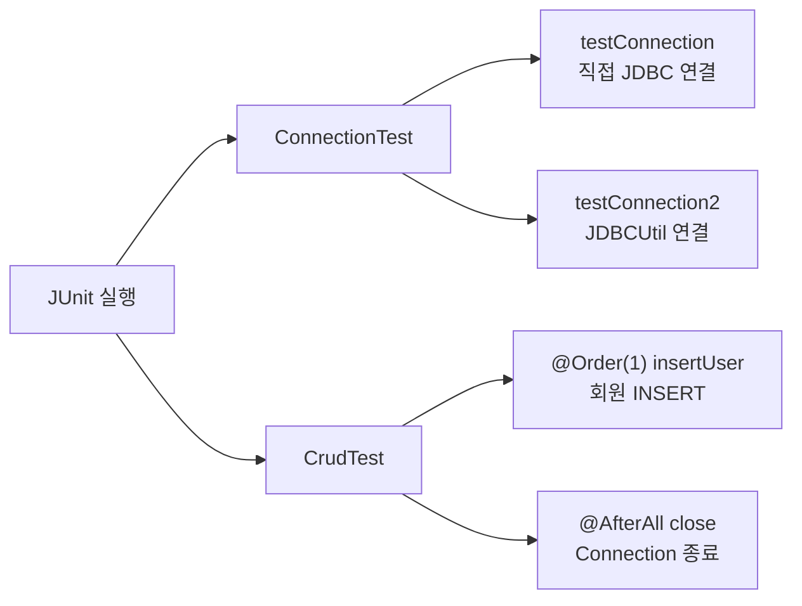

# JDBC Ex

Java JDBC 연습 프로젝트입니다. MySQL 데이터베이스에 연결하고, `PreparedStatement`를 사용해 CRUD(Create, Read, Update, Delete) 작업을 수행합니다. JUnit 5로 단계별 테스트를 진행합니다.

---

## 프로젝트 구조



---

## JDBC 연결 흐름

JDBC는 DB와 통신하기 위해 **4단계**를 거칩니다.



---

## 파일 구성

| 경로 | 역할 | 설명 |
|------|------|------|
| `src/main/java/org/scoula/jdbc_ex/common/JDBCUtil.java` | DB 연결 유틸 | static 블록으로 드라이버 로딩 및 Connection 생성 |
| `src/main/resources/application.properties` | DB 설정 | 드라이버, URL, 계정 정보 |
| `src/test/java/org/scoula/jdbc_ex/ConnectionTest.java` | 연결 테스트 | JDBC 직접 연결 / JDBCUtil 연결 검증 |
| `src/test/java/org/scoula/jdbc_ex/CrudTest.java` | CRUD 테스트 | INSERT 등 SQL 실행 테스트 |
| `users.sql` | DB 초기화 | DB·테이블 생성 및 샘플 데이터 |
| `build.gradle` | 빌드 설정 | MySQL Connector, Lombok, JUnit 5 의존성 |

---

## 클래스 / 메서드 정리

### JDBCUtil

| 메서드 | 반환 타입 | 설명 |
|--------|-----------|------|
| `getConnection()` | `Connection` | static 블록에서 생성된 Connection 반환 |
| `close()` | `void` | Connection 종료 후 `null` 처리 |

### ConnectionTest

| 메서드 | 테스트 내용 |
|--------|-------------|
| `testConnection()` | `Class.forName` + `DriverManager`로 직접 DB 연결 |
| `testConnection2()` | `JDBCUtil`을 통한 DB 연결 및 종료 |

### CrudTest

| 메서드 | `@Order` | 테스트 내용 |
|--------|----------|-------------|
| `insertUser()` | 1 | `users` 테이블에 회원 INSERT |
| `close()` | `@AfterAll` | 모든 테스트 후 Connection 종료 |

---

## DB 스키마

### USERS 테이블

| 컬럼 | 타입 | 제약 | 설명 |
|------|------|------|------|
| `ID` | `VARCHAR(12)` | PK, NOT NULL | 사용자 아이디 |
| `PASSWORD` | `VARCHAR(12)` | NOT NULL | 비밀번호 |
| `NAME` | `VARCHAR(30)` | NOT NULL | 이름 |
| `ROLE` | `VARCHAR(6)` | NOT NULL | 권한 (`USER`, `ADMIN`) |

---

## 사전 준비

### 1. MySQL 데이터베이스 생성

`users.sql`을 실행하여 DB, 사용자, 테이블을 생성합니다.

```sql
CREATE DATABASE jdbc_ex;

CREATE USER 'scoula'@'%' IDENTIFIED BY '1234';
GRANT ALL PRIVILEGES ON jdbc_ex.* TO 'scoula'@'%';
FLUSH PRIVILEGES;

USE jdbc_ex;

CREATE TABLE USERS (
    ID       VARCHAR(12) NOT NULL PRIMARY KEY,
    PASSWORD VARCHAR(12) NOT NULL,
    NAME     VARCHAR(30) NOT NULL,
    ROLE     VARCHAR(6)  NOT NULL
);
```

### 2. application.properties 설정

```properties
driver=com.mysql.cj.jdbc.Driver
url=jdbc:mysql://127.0.0.1:3306/jdbc_ex
id=scoula
password=1234
```

---

## 핵심 코드 설명

### 1. JDBC 직접 연결 (ConnectionTest)

드라이버 로딩 → Connection 획득 → 사용 후 종료 순서로 동작합니다.

```java
// 1단계: JDBC 드라이버 로딩
Class.forName("com.mysql.cj.jdbc.Driver");

// 2단계: DB 연결 (url, id, password)
String url = "jdbc:mysql://127.0.0.1:3306/jdbc_ex";
Connection con = DriverManager.getConnection(url, "scoula", "1234");

// 3단계: 자원 해제
con.close();
```

### 2. JDBCUtil — 연결 공통화

CRUD 작업마다 1~2단계(드라이버 로딩, 연결)를 반복하지 않도록 static 블록에서 한 번만 초기화합니다.

```java
static {
    Properties properties = new Properties();
    properties.load(JDBCUtil.class.getResourceAsStream("/application.properties"));

    String driver   = properties.getProperty("driver");
    String url      = properties.getProperty("url");
    String id       = properties.getProperty("id");
    String password = properties.getProperty("password");

    Class.forName(driver);
    con = DriverManager.getConnection(url, id, password);
}

public static Connection getConnection() {
    return con;
}
```

> **static 블록이란?**  
> 객체 생성(`new`) 없이 클래스 로딩 시점에 자동 실행되는 초기화 블록입니다.  
> `static` 필드(`con`)는 생성자로 초기화할 수 없으므로 static 블록을 사용합니다.

### 3. INSERT — PreparedStatement (CrudTest)

`?` 플레이스홀더로 SQL Injection을 방지하고, 값을 순서대로 바인딩합니다.

```java
String sql = "INSERT INTO users(id, password, name, role) VALUES(?, ?, ?, ?)";
PreparedStatement pstmt = con.prepareStatement(sql);

pstmt.setString(1, "winner2");  // id
pstmt.setString(2, "1234");     // password
pstmt.setString(3, "win");      // name
pstmt.setString(4, "admin");    // role

int row = pstmt.executeUpdate(); // 영향받은 행 수 반환
pstmt.close();
```

---

## 테스트 실행 흐름



### 테스트 실행 명령

```bash
# Windows
gradlew.bat test

# macOS / Linux
./gradlew test
```

특정 테스트만 실행:

```bash
gradlew.bat test --tests "org.scoula.jdbc_ex.ConnectionTest"
gradlew.bat test --tests "org.scoula.jdbc_ex.CrudTest"
```

---

## 의존성

| 라이브러리 | 버전 | 용도 |
|------------|------|------|
| `mysql-connector-j` | 8.3.0 | MySQL JDBC 드라이버 |
| `lombok` | 1.18.30 | 보일러플레이트 코드 제거 |
| `junit-jupiter` | 5.10.0 | 단위 테스트 |

---

## JDBC 단계 요약

| 단계 | 작업 | 사용 클래스 / 메서드 |
|------|------|----------------------|
| 1 | 드라이버 로딩 | `Class.forName(driver)` |
| 2 | DB 연결 | `DriverManager.getConnection(url, id, pw)` |
| 3 | SQL 실행 | `Connection.prepareStatement(sql)` |
| 4 | 자원 해제 | `Connection.close()`, `PreparedStatement.close()` |
